# Proyecto Segunda Nota: Interfaz de Procesamiento de Imágenes

## Descripción general

Este proyecto implementa una **interfaz gráfica interactiva** para el **procesamiento digital de imágenes**, desarrollada en **Python** utilizando las librerías:

- `Tkinter` → interfaz gráfica de usuario (GUI)
- `Pillow (PIL)` → lectura, escritura y manipulación de imágenes
- `NumPy` → manejo de matrices e imágenes normalizadas
- `Matplotlib` → visualización de histogramas
- `imgControl.py` → librería personalizada con las funciones de procesamiento

La aplicación permite **abrir, modificar, visualizar y guardar imágenes**, aplicando una amplia gama de transformaciones visuales y geométricas, además de soportar **fusión ponderada entre dos imágenes**.

---

## Objetivos

1. Implementar una interfaz amigable que permita ejecutar funciones de procesamiento de imágenes sin necesidad de código.
2. Aplicar operaciones fundamentales como:
   - Negativo, escala de grises, binarización
   - Ajuste de brillo y canales RGB
   - Contraste logarítmico y exponencial
   - Rotación, zoom visual y fusión
3. Mostrar resultados de forma inmediata y visual.
4. Visualizar histogramas RGB como apoyo al análisis de intensidad.

---

##  Estructura del proyecto

```
Proyecto_Imagenes/
│
├── interfaz.py          # Interfaz principal (Tkinter)
├── imgControl.py        # Funciones de procesamiento (lógica)
├── README.md            # Documento explicativo (este archivo)
└── /capturas            # Carpeta para capturas del funcionamiento
```

---

## Requisitos e instalación

### 1️. Instalar dependencias

Ejecutar en consola:

```bash
pip install pillow matplotlib numpy
```

> Tkinter viene preinstalado con Python en la mayoría de versiones oficiales (Windows y macOS).  
> En Linux puede instalarse con:
> ```bash
> sudo apt install python3-tk
> ```

### 2️. Estructurar los archivos

Se debe asegurar tener en la misma carpeta:
- `interfaz.py`
- `imgControl.py`

### 3️. Ejecutar el programa

```bash
python interfaz.py
```

---

##  Funcionamiento general

La aplicación abre una ventana con **dos paneles principales**:

- **Panel izquierdo (controles)** → contiene botones, sliders y secciones para aplicar transformaciones.  
  Incluye scroll vertical para acceder a todas las herramientas.

- **Panel derecho (visualización)** → muestra la imagen actual en pantalla.

###  Estructura visual

```
┌────────────────────────────────────────────────────────────┐
│ PANEL IZQUIERDO (controles)     │ PANEL DERECHO (imagen)   │
│---------------------------------│--------------------------│
│ [Abrir Imagen]                  │                          │
│ [Aplicar Brillo]                │        (Imagen)          │
│ [Rotar Imagen]                  │                          │
│ [Fusionar Imagenes]             │                          │
└────────────────────────────────────────────────────────────┘
```

---

## Explicación por secciones

### . 1. Carga y guardado de imágenes
Permite abrir imágenes (`.jpg`, `.png`, `.jpeg`) y mostrarlas en pantalla.

```python
self.img = np.array(Image.open(ruta).convert("RGB")) / 255.0
```

La imagen se normaliza al rango `[0, 1]` para facilitar las operaciones numéricas.  
Se guarda una copia original (`self.img_original`) para permitir la restauración.

Funciones:
- `abrir_imagen()`  
- `guardar_imagen()`  
- `restaurar_original()`

 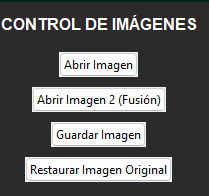

---

###  2. Transformaciones básicas

#### 🔸 Negativo
Invierte los valores de los píxeles (`1 - valor`).

```python
self.img = imgControl.Negativo(self.img)
```

#### 🔸 Escala de grises
Convierte la imagen RGB a una sola intensidad, replicando en los tres canales.

#### 🔸 Binarización
Aplica un umbral (por defecto 0.5) y genera una imagen blanco/negro.

#### 🔸 Contraste
- Logarítmico → resalta tonos oscuros.
- Exponencial → resalta tonos claros.

#### 🔸 Histograma
Visualiza la distribución de intensidades de cada canal (R, G, B) con Matplotlib.

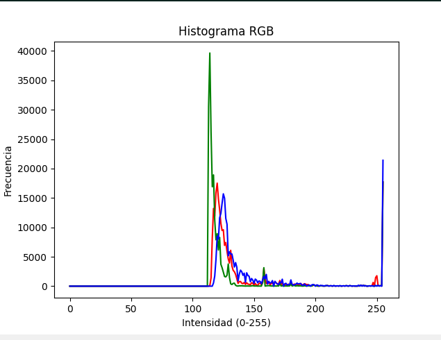
- _Histograma RGB abierto tras aplicar contraste exponencial._

---

### 🔹 3. Ajuste de brillo y canales

- **Brillo:** controlado por `self.slider_brillo`, ajusta todos los canales.
- **Canales RGB:** tres botones aplican cambios individualmente a R, G o B.

```python
self.img = imgControl.SumarBrillo(self.img, valor)
self.img = imgControl.AjusteCanal(self.img, canal, ajuste)
```

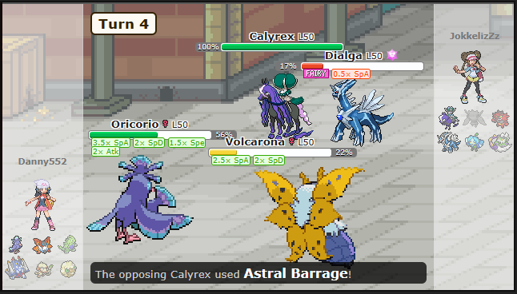
- _Antes del ajuste de brillo._

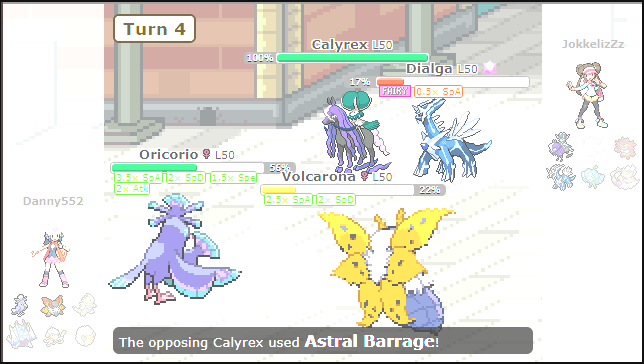
- _Después del ajuste de brillo (0.30)._

### 🔹 4. Transformaciones geométricas

- **Rotar:** gira la imagen según el ángulo elegido.  
- **Zoom visual:** cambia el tamaño mostrado, sin modificar los datos originales.

```python
self.zoom_factor = self.slider_zoom.get()
self.mostrar_imagen(self.img)
```

El zoom es **no destructivo** — solo afecta la vista, no los valores internos.

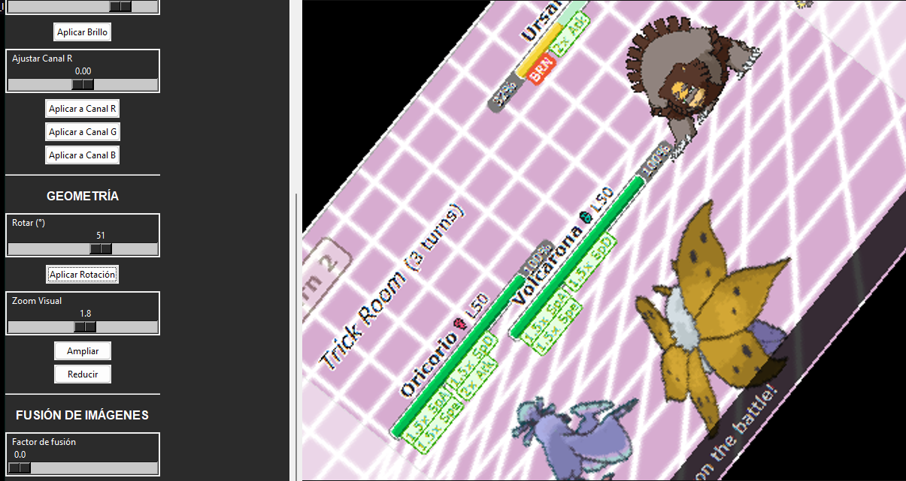
_Imagen rotada (51°) y ampliada visualmente (x1.8)._

---

### 🔹 5. Fusión de imágenes

Permite combinar dos imágenes con un **factor de fusión** entre 0 y 1.

```python
self.img = imgControl.CombinarF(img1, img2, factor)
```

- Si `factor = 0`, se muestra solo la imagen 2.  
- Si `factor = 1`, se muestra solo la imagen 1.  
- Valores intermedios generan mezclas ponderadas.

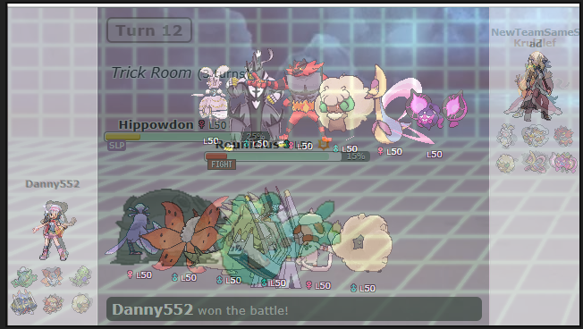
- _Resultado de la fusión de dos imágenes distintas (factor 0.4)._

---

## Procesamiento numérico interno

Todas las imágenes se tratan como matrices NumPy normalizadas a `[0,1]`.  
Ejemplo: un píxel rojo puro `(255,0,0)` pasa a `(1.0, 0.0, 0.0)`.

Esto facilita operaciones vectorizadas:

| Operación | Fórmula NumPy |
|------------|----------------|
| Negativo | `1 - img` |
| Brillo | `np.clip(img + valor, 0, 1)` |
| Fusión | `(img1 * α) + (img2 * (1 - α))` |
| Canal R | `img[:,:,0] += ajuste` |

---

##  Diagrama lógico del flujo

```text
 ┌────────────┐
 │ Abrir img  │
 └──────┬─────┘
        │
        ▼
 ┌───────────────┐
 │ Aplicar op.   │
 │ (Neg, Gris...)│
 └──────┬────────┘
        │
        ▼
 ┌────────────────┐
 │ Mostrar img    │
 │ (panel derecho)│
 └──────┬─────────┘
        │
        ▼
 ┌───────────────┐
 │ Guardar /     │
 │ Restaurar     │
 └───────────────┘
```

---

##  Características técnicas destacables

| Característica | Descripción |
|----------------|--------------|
| **Interfaz con scroll** | El panel de controles usa `Canvas + Frame` para desplazarse verticalmente. |
| **Zoom visual** | Escalado visual (no destructivo) mediante `PIL.Image.resize()`. |
| **Modularidad** | Toda la lógica de procesamiento está separada en `imgControl.py`. |
| **Normalización** | Manejo interno de imágenes en `float [0,1]` para estabilidad numérica. |
| **Compatibilidad** | Soporta formatos `.jpg`, `.png`, `.jpeg`. |

---


## Capturas de funcionamiento

> Inserta aquí tus imágenes de demostración en el orden sugerido:

1. **Interfaz inicial sin imagen**
   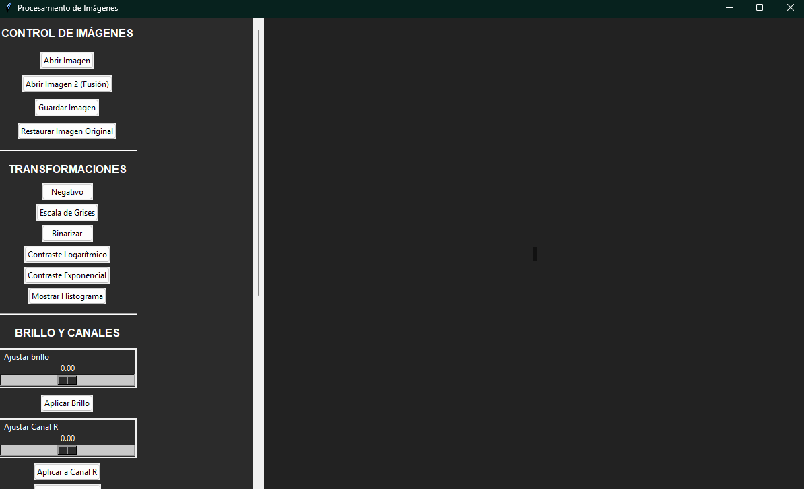

2. **Imagen cargada**
   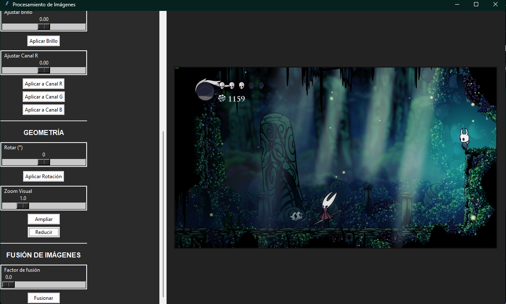

3. **Aplicación de grises**
   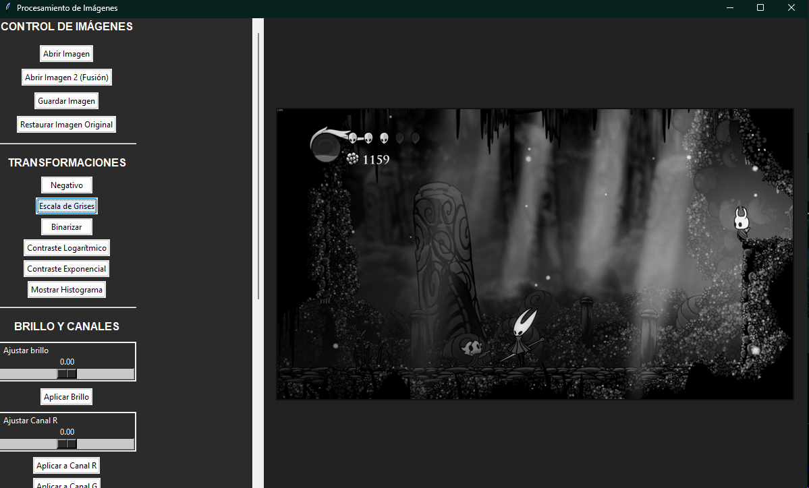

4. **Rotación y zoom visual**
   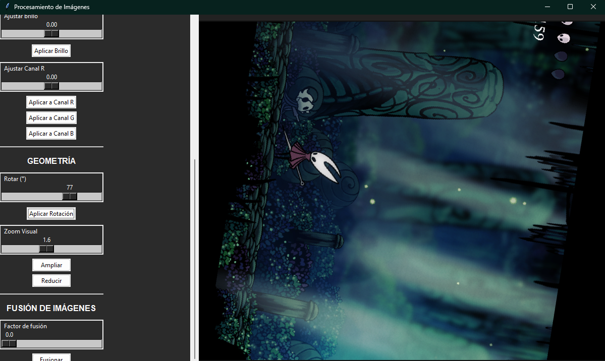

5. **Fusión de dos imágenes**
   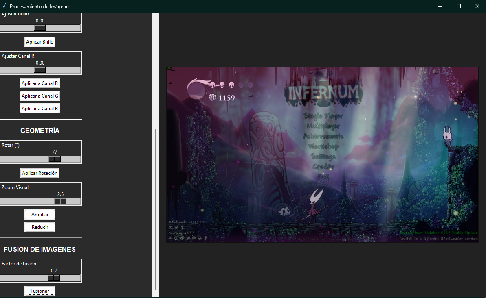

6. **Histograma RGB**
   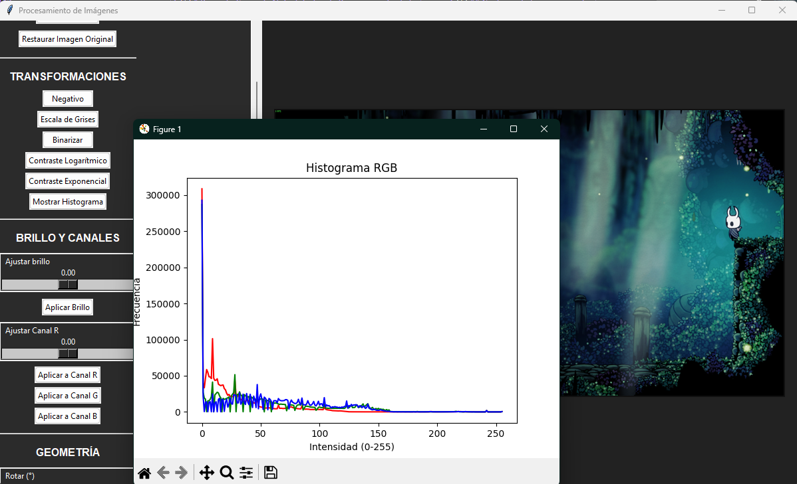

---

## Conclusiones

- Se desarrolló una interfaz funcional y clara que permite la manipulación visual de imágenes sin requerir conocimientos de programación.
- Se logró integrar **procesamiento matricial (NumPy)** con **visualización (Tkinter + PIL)**.
- La separación entre interfaz (`interfaz.py`) y lógica (`imgControl.py`) facilita mantenimiento, ampliación y pruebas.

---

## Autores

**Nombres:** Daniel Henao, Juan Camilo Cano, Miguel Angel Arias  
**Proyecto:** Procesamiento de Imágenes — Interfaz con Tkinter  
**Lenguaje:** Python 3.11  
**Año:** 2025  
**_Universidad Tecnológica de Pereira_**

